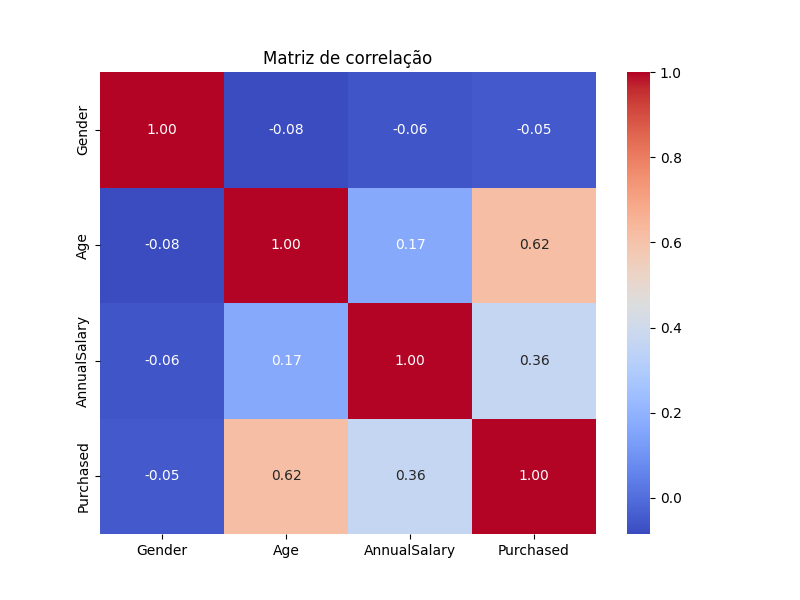
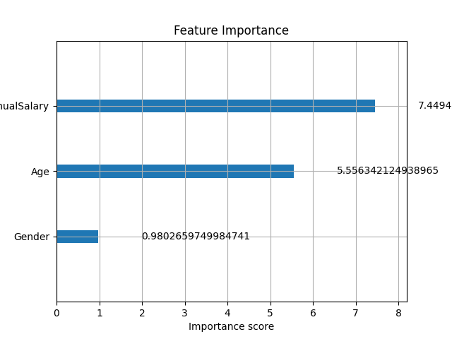
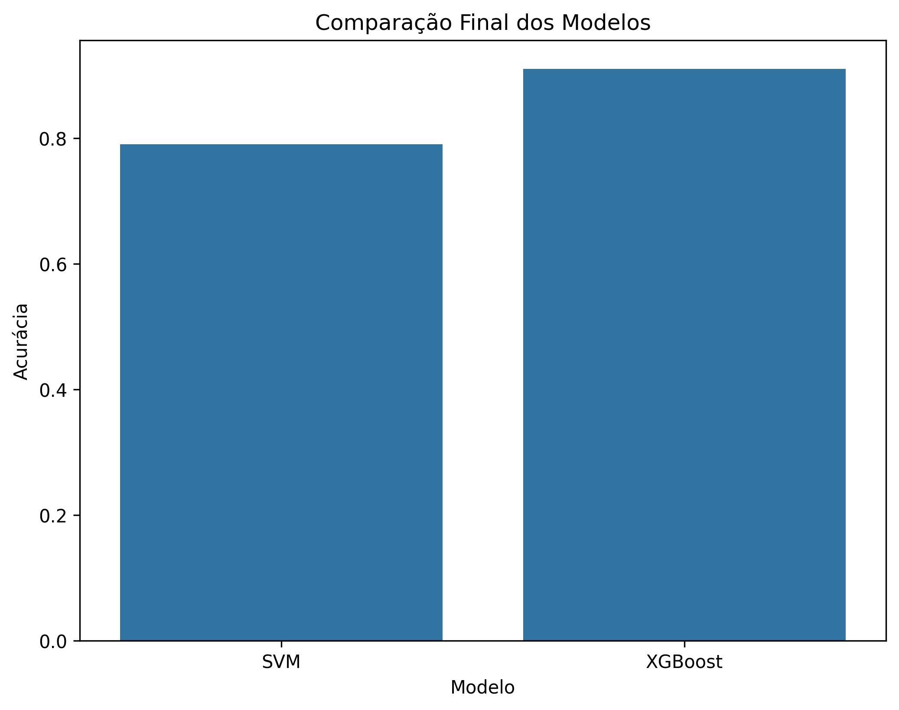

### Car Purchase Propensity Prediction

## Uma análise preditiva para identificação de clientes com maior probabilidade de compra

## Contexto do Problema

No setor automotivo, identificar clientes com maior propensão de compra é essencial para otimizar campanhas de marketing, direcionar esforços comerciais e aumentar taxas de conversão.

A análise preditiva permite antecipar comportamentos de compra a partir de características demográficas, comportamentais e financeiras.

Este projeto busca responder à seguinte pergunta:

**Quais fatores estão mais associados à decisão de compra de veículos e qual modelo apresenta melhor capacidade preditiva?**

___

## Objetivo

Utilizar técnicas de análise de dados e Machine Learning para prever a propensão de compra de veículos, comparando diferentes modelos de classificação e identificando as variáveis mais relevantes para o processo de decisão.

___

## Fonte de Dados

Os dados utilizados contêm informações sobre características dos clientes e seu comportamento em relação à aquisição de veículos.

## Variáveis selecionadas:
- 	Gender
- 	Age
-  Annual Salary
-  Credit Card Debt
-  Net Worth
-  Car Purchase Amount

Variável target:
- 	Purchase Decision
- 	0 = Não comprou
-  1 = Comprou

___

## Coleta e Tratamento de Dados

## O processo de preparação incluiu:
- 	Verificação de valores ausentes
- 	Tratamento e padronização de variáveis numéricas
-    Análise de correlação entre variáveis
-    paração entre variáveis independentes (X) e variável target (y)
-    eparação para treinamento e validação

Essas etapas garantiram maior consistência dos dados para modelagem.

___

## Análise Exploratória de Dados (EDA)

A análise exploratória revelou padrões importantes:

## Principais achados:
- 	Variáveis financeiras apresentaram forte relação com a decisão de compra.
- 	Clientes com maior patrimônio líquido apresentaram maior propensão à aquisição.
-   Idade e renda anual mostraram influência relevante no comportamento de compra.

A matriz de correlação ajudou a identificar relações importantes entre as variáveis.

___

## Modelagem

Foram treinados e comparados dois modelos de classificação:
- 	Support Vector Machine (SVM)
- 	XGBoost

## Etapas da modelagem:
- 	Train/Test Split
- 	Padronização de variáveis
-   Treinamento dos modelos
-   Avaliação com métricas de classificação
-   Comparação de desempenho
-   Análise de importância das variáveis

___

## Resultados 

Comparação dos modelos 
| Modelo | Accuracy | F1-score |
| --- | ---:  | ---: |
| SVM | 0.79 | 0.74 |
| XGBoost | 0.91 | 0.89 |

*O XGBoost apresentou melhor desempenho final*, superando o SVM na capacidade preditiva.

Esse resultado reforça a eficiência de métodos baseados em ensemble para problemas de classificação com múltiplas relações não lineares.

___

## Visualizações 

### Matriz de Correlação

---

### Importância das Variáveis (XGBoost)

---

### Comparação Final dos Modelos

___

## Conclusões 

Conclusões

Os resultados mostraram que técnicas de Machine Learning podem ser eficazes para identificar clientes com maior propensão de compra de veículos, permitindo apoiar estratégias comerciais mais assertivas.

Ao longo do projeto, foram realizadas etapas de análise exploratória, tratamento de dados, modelagem preditiva e comparação entre algoritmos.

Na avaliação final, o modelo XGBoost apresentou melhor desempenho em relação ao SVM, demonstrando maior capacidade preditiva para este conjunto de dados.

Além da performance superior, a análise de importância das variáveis permitiu identificar os fatores mais relevantes para a tomada de decisão, reforçando o potencial do uso de dados para otimização de campanhas de vendas e segmentação de clientes.

___

## Tecnologias Utilizadas
- 	Python
- 	Pandas
-   NumPy
-   Matplotlib
-   Seaborn
-   Scikit-learn
-   XGBoost
-   Google Colab

